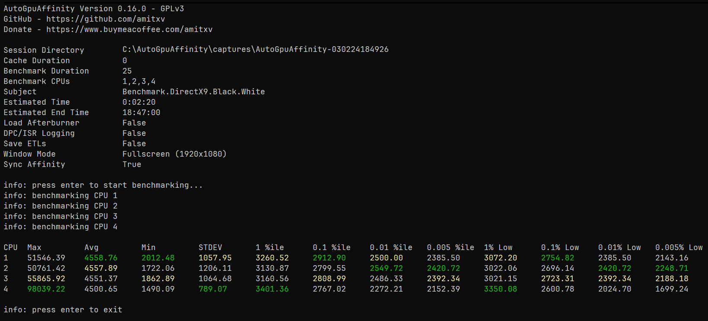

# AutoGpuAffinity



I am not responsible for damage caused to computer. There is a risk of your GPU driver not responding after restarting it during the tests. A possible fix for this is to set the PCIe link speed to the maximum supported in BIOS ([#14](https://github.com/amitxv/AutoGpuAffinity/issues/14)).

[](https://www.buymeacoffee.com/amitxv)

## Usage

```
AutoGpuAffinity
GitHub - https://github.com/amitxv

usage: AutoGpuAffinity.py [-h] [--config <config>] [--analyze <csv directory>] [--apply_affinity <cpu>]

optional arguments:
  -h, --help            show this help message and exit
  --config <config>     path to config file
  --analyze <csv directory>
                        analyze csv files from a previous benchmark
  --apply_affinity <cpu>
                        assign a single core affinity to graphics drivers
```

- Windows ADK must be installed for DPC/ISR logging with xperf (this is entirely optional)

    - [ADK for Windows 8.1+](https://docs.microsoft.com/en-us/windows-hardware/get-started/adk-install)

    - [ADK for Windows 7](http://download.microsoft.com/download/A/6/A/A6AC035D-DA3F-4F0C-ADA4-37C8E5D34E3D/setup/WinSDKPerformanceToolKit_amd64/wpt_x64.msi)

- Maintain overclock settings with MSI Afterburner throughout the benchmark

    - Save the desired settings to a profile (e.g. profile 1)

    - Configure the path along with the profile to load in ``config.ini``

- Download and extract the latest release from the [releases tab](https://github.com/amitxv/AutoGpuAffinity/releases)

- Run **AutoGpuAffinity** through the command-line and press enter when ready to start benchmarking

- After the tool has benchmarked each core, the GPU affinity will be reset to the Windows default and a table will be displayed with the results. The xperf report is located in the session directory

- Run the tool two or three times. If the same core is consistently performant and no 0.005% Lows values are absurdly low compared to other results, then your results are reproducible and your testing environment is consistent

## Analyze Old Sessions

Accidentally exited the program after the results' table was displayed? Don't worry, you can analyze the CSV logs again at any time by passing the folder of CSVs to the ``--analyze`` argument (example below).

```bat
AutoGpuAffinity --analyze "captures\AutoGpuAffinity-170523162424\CSVs"
```

## Standalone Benchmarking

AutoGpuAffinity *can* be used as a regular benchmark if **custom_cores** is set to a single core in **config.txt**. If you do not usually configure the GPU driver affinity, the array can be set to **[0]** as the graphics kernel runs on CPU 0 by default. This results in an automated liblava benchmark completely independent to benchmarking the GPU driver affinity.
